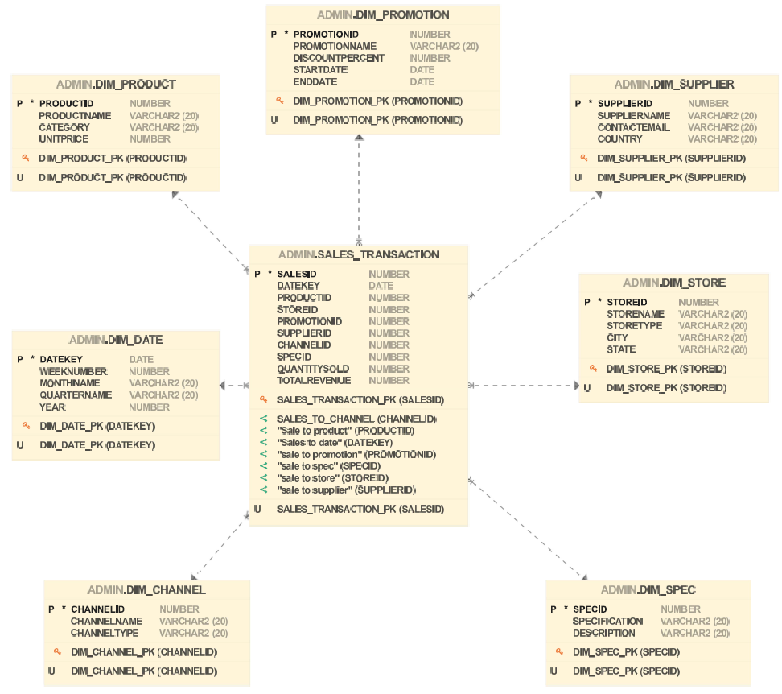
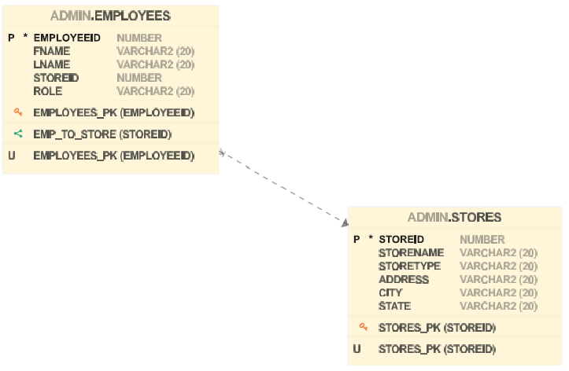

## Guac-Gear-and-Beyond-GGB----Business-Intelligence-Project
An End to End Data Warehousing and Analytics Solution

## Overview
This project builds a complete **BI pipeline** for **Guac Gear and Beyond**, covering data ingestion, transformation, warehousing, and dashboarding.The goal was to create an efficient and scalable data pipeline that enables **real-time insights** and **decision-making**.

Tech Stack
- 📂 **Oracle Cloud** – Data warehouse hosting and management
- 🔄 **Apache Hop** – ETL pipeline design and orchestration
- 📈 **Power BI** – Data visualization and dashboard development

## Project Workflow
1️⃣ **Setting Up the Cloud Data Warehouse**Configured a cloud-based data warehousing environment using **Oracle Cloud**.
- Built **dimension and fact tables** using **SQL DDL statements** to define relationships and enforce data integrity.
- Addressed key architectural considerations:
  - ✅ **Date Dimension Enhancement** – Implemented dynamic date structures for efficient time management.
  - ✅ **Fact Table Relationships** – Ensured a **star schema** design by linking fact tables only through shared dimensions.

 📌 **Dimensional Model**

 

**2️⃣ Creating the ETL Pipeline with Apache Hop**
- Designed an ETL pipeline to populate the data warehouse.

- Key challenges and solutions:
  - ⚠️ **Column Name Mismatches** –  `STATE` vs `STATEPROV` field differences caused "invalid identifier" errors in Apache Hop.Fixed by correcting the field mappings inside the Dimension             Lookup/Update step.
  - 🛠️ **Null Column Error (SCD_START)** - Insert pipeline failed with a confusing null column error. Root cause was a missing `SCD_START` field required for SCD (Slowly Changing Dimension) versioning. Adding the field resolved the insert.
  - 🔗 **ZIP Code Data Type Mismatch** - Excel stored ZIP codes as floats (e.g., `14321.0`) while Oracle expected VARCHAR2. Fixed by adding a **Select Values** step in Apache Hop to cast ZIP to String before loading into the database.

📌 **ETL Pipeline Flow**

 
